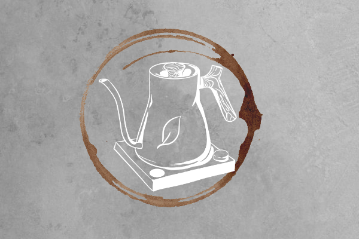

<!-- PROJECT LOGO -->
<br />
<p align="center">
  <a href="https://github.com/github_username/repo_name">
     
  </a>

  <h3 align="center">Kettle Whistle</h3>

  <p align="center">
    An app for rocking that at-home barista life! Great for these covid times and pursuing a lifelong passion for coffee and tea. In this app you gain many recipes for coffee and tea for different methods and types. Coming soon! Nerdy knowledge into these beverages from seed to cup. 
    <br />
     <a href="https://github.com/sydneygold/hey-remember-that-friend-fe"><strong>Frontend Repo»</strong></a>
     <a href="https://github.com/sydneygold/hey-remember-that-friend-be"><strong>Backend Repo»</strong></a>
     <a href="https://www.loom.com/share/f976afe141ea46c2b587462899f9a5bf"><strong>Demo»</strong></a>
    <br />
    <br />
    ·
    <a href="https://github.com/sydneygold/issues">Report Bug</a>
    ·
    <a href="https://github.com/sydneygold/issues">Request Feature</a>
  </p>
</p>


<!-- TABLE OF CONTENTS -->
<details open="open">
  <summary><h2 style="display: inline-block">Table of Contents</h2></summary>
  <ol>
    <li>
      <a href="#about-the-project">About The Project</a>
      <ul>
        <li><a href="#built-with">Built With</a></li>
      </ul>
    </li>
    <li>
      <a href="#getting-started">Getting Started</a>
      <ul>
        <li><a href="#prerequisites">Prerequisites</a></li>
        <li><a href="#installation">Installation</a></li>
      </ul>
    </li>
    <li><a href="#usage">Usage</a></li>
    <li><a href="#roadmap">Roadmap</a></li>
    <li><a href="#contributing">Contributing</a></li>
    <li><a href="#contact">Contact</a></li>
  </ol>
</details>


<!-- ABOUT THE PROJECT -->
## About The Project

<p> Before becoming a dev, being a competitive barista was my dream. While it's enjoyable, albiet frustrating sometimes, mastering the artistry of latte art, it was the science behind pourovers that really captured my passion. I learned pretty early on that there's a ton of misinformation and poorly crafted recipes out there! And to me, bad coffee can ruin my entire day. So I wanted to share a passion project of mine holding some tried and true recipes from prestigious roasteries to help close the gap between coffee shop quality and at home brewing. 

This version of Kettle Whistle is the first trial version of my adventure into the framework Flutter. I have plenty of updates in mind to really bring it to life with engaging and quality content and the functionality to match. *small humble brag alert* I came into this project with NO knowledge of Flutter or Dart! Nor did I have many fellow devs who had any experience in these techs. Just thought I'd through that out there. I've come a long way in three weeks!
</p>


### Built With

Frontend:
* Flutter Ver. `1.0.0+1`

Backend: 
* Ruby on Rails Ver. `2.6.1`
* Postgresql Ver. `2.0`


<!-- GETTING STARTED -->
## Getting Started

### Prerequisites
So techs to make sure are installed:
* Ruby on Rails --> Not *completely* necessary unless you want to make changes to the backend. It's also deployed [here](https://kettle-whistle-be.herokuapp.com/coffees)
* Dart
* Flutter
* Android Studio
* Xcode --> Prewarning: I do not have Xcode installed and did not tailor this app for iOS, so I'm not sure what will be different.

I used VSCode for this, so I'd recommend installing the Dart and Flutter extensions


### Installation

1. Clone the repo
   ```sh
   git clone https://github.com/sydneygold/hey-remember-that-friend-be
   ```
  -Or, as mentioned above, you can simply just call from the deployed site
  
 2. Clone this current repo


<!-- USAGE EXAMPLES -->
## Usage

Use this app to keep up with recipes for coffee and tea and time your brews for the perfect cup! You can also use it to learn more about Flutter and how styling/functionality works

<!-- CONTRIBUTING -->
## Contributing

Contributions are what make the open source community such an amazing place to be learn, inspire, and create. Any contributions you make are **greatly appreciated**.

1. Fork the Project
2. Create your Feature Branch (`git checkout -b feature/AmazingFeature`)
3. Commit your Changes (`git commit -m 'Add some AmazingFeature'`)
4. Push to the Branch (`git push origin feature/AmazingFeature`)
5. Open a Pull Request


<!-- CONTACT -->
## Contact

Sydney Goldberg - [my LinkedIn](https://www.linkedin.com/in/sydney-goldberg-32b9751b0/)


<!-- MARKDOWN LINKS & IMAGES -->
<!-- https://www.markdownguide.org/basic-syntax/#reference-style-links -->
[contributors-shield]: https://img.shields.io/github/contributors/github_username/repo.svg?style=for-the-badge
[contributors-url]: https://github.com/github_username/repo/graphs/contributors
[forks-shield]: https://img.shields.io/github/forks/github_username/repo.svg?style=for-the-badge
[forks-url]: https://github.com/github_username/repo/network/members
[stars-shield]: https://img.shields.io/github/stars/github_username/repo.svg?style=for-the-badge
[stars-url]: https://github.com/github_username/repo/stargazers
[issues-shield]: https://img.shields.io/github/issues/github_username/repo.svg?style=for-the-badge
[issues-url]: https://github.com/github_username/repo/issues
[license-shield]: https://img.shields.io/github/license/github_username/repo.svg?style=for-the-badge
[license-url]: https://github.com/github_username/repo/blob/master/LICENSE.txt
[linkedin-shield]: https://img.shields.io/badge/-LinkedIn-black.svg?style=for-the-badge&logo=linkedin&colorB=555
[linkedin-url]: https://linkedin.com/in/github_username
